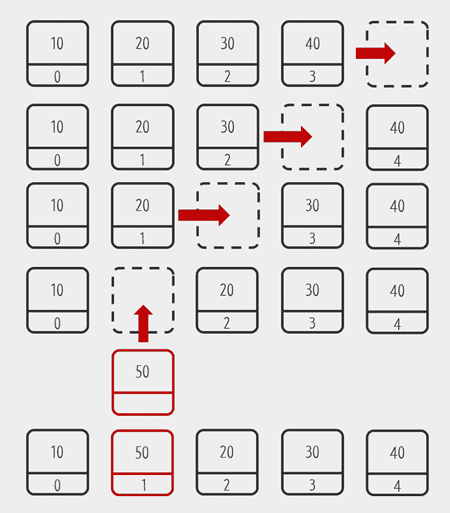
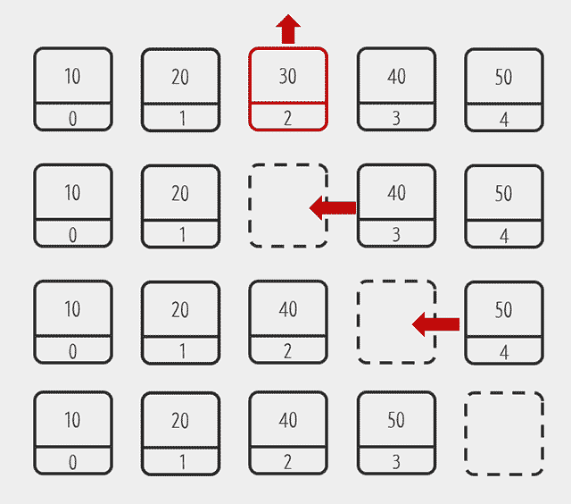
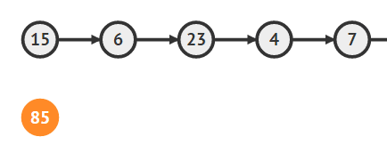
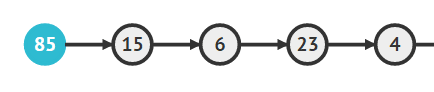
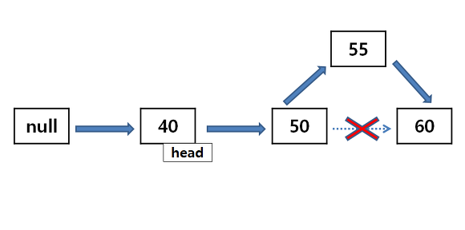

<hr>

## 목차 

[**1. Array**](#1-array)
- [배열의 특징](#배열의-특징)
- [배열의 한계](#배열의-한계)

[**2. List**](#2-list)
- [List의 기능](#list의-기능)
- [내장된 List](#내장된-list)

[**3. ArrayList**](#3-arraylist)
- [ArrayList 데이터 추가](#3-1-데이터-추가)
- [ArrayList 데이터 삭제](#3-2-데이터-삭제)

[**4. Linked List**](#4-linked-list)
- [Linked List 데이터 추가](#4-1-데이터-추가)

[**5. ArrayList / LinkedList**](#3-arraylist--linkedlist)
- [ArrayList의 특징](#3-1-arraylist-특징)
- [LinkedList의 특징](#3-2-linkedlist-특징)
<hr>

<br>

# 배열과 리스트 

<br>

## 1. Array 

> 배열이란 연관된 데이터를 하나의 변수에 그룹핑해서 관리하기 위한 방법이다. <br>
> 배열을 이용하면 하나의 변수에 여러 정보를 담을 수 있고, 반복문과 결합하면 많은 정보도 효율적으로 처리할 수 있다. 
> - 데이터가 많아지면 그룹 관리의 필요성이 생기는데, 이럴때 사용하는 것이 배열 
> - 배열 인덱스는 값에 대한 유일무이한 식별자이다. 

### java array 예시 
```java
// array 정의 
int [] array = new int[4]; 

// array에 값 저장 
array[0] = 1; 
array[1] = 2; 
array[2] = 3; 

// array 길이 확인 
System.out.println(array.length); // 4
```
처음 정의시 크기를 4로 지정하였기 때문에 3개의 값이 설정되었음에도 불구하고 결과값은 4이다. 

<br>

### 배열의 특징 
> - 크기가 정해져 있다. 
> - 인덱스를 가지며, 엘리먼트의 인덱스는 변경되지 않는다. 
> - 인덱스를 활용하여 빠르게 조회가 가능하다. 
> - 인덱스를 이용하여 데이터를 가져오려면 데이터에 대한 인덱스 값이 고정되어야 한다. (삭제된 엘리먼트의 공간이 그대로 남아있는다 → 메모리 낭비)

### 배열의 한계 
> - 배열은 길이를 바꿀 수 없다. 
> <br> → 이와 같은 한계를 해결하기 위해서 Linked List 자료형을 활용 할 수 있다.
> - 배열은 인덱스에 따라서 값을 유지하기 때문에, 엘리먼트가 삭제되어도 null값이 남게 된다. 
> <br> → 불필요한 메모리 차지 

<br>

## 2. List 

> - 리스트는 배열이 가지고 있는 인덱스라는 장점을 버리고 **빈틈없는 데이터의 적재**라는 장점을 취한 데이터 스트럭쳐
> - 리스트의 핵심적인 개념은 **순서가 있는 엘리먼트의 모임** 이다.<br> 
> → 빈 엘리먼트는 허용하지 않는다. <br>
> → 중복된 데이터는 허용한다. (중복 허용은 배열과 리스트의 차이가 아님)

### List의 기능 
> - 처음, 끝, 중간에 엘리먼트를 추가/삭제 하는 기능 
> - 리스트에 데이터가 있는지를 체크 
> - 리스트의 모든 데이터에 접근할 수 있는 기능   

### 내장된 List 
- #### javaScript 
자바스크립트의 경우는 배열에 리스트의 기능을 포함하고 있다. 
```js
numbers = [10, 20, 30, 40, 50]; 

// 인덱스 3의 값을 제거 
numbers.splice(3,1); 

for(let i = 0; i < numbers.length; i++) {
    console.log(numbers[i]); // 10, 20, 30, 50
}
```
> splice는 배열 numbers의 3번째 인덱스의 엘리먼트를 삭제한다. 삭제된 엘리먼트가 있던 자리는 뒤의 엘리먼트에 의해서 채워진다.<br>
> 즉, 자바스크립트의 배열은 리스트의 기능도 포함하고 있는 것이라고 할 수 있다. 

- #### java 
> - 자바는 배열과 리스트를 모두 지원하고, 두가지가 완전히 분리되어있다.
> - 자바는 2가지 형태의 리스트를 지원한다 
>   - Linked List / ArrayList 
```java
// 배열 - 추가, 삭제가 어렵다. 
int[] numbers = [10, 20, 30, 40, 50]; 

// 리스트 (ArrayList) 
ArrayList numbers = new ArrayList(); 

numbers.add(10); //추가 
numbers.remove(0); //삭제

// 리스트 (Linked List) 
LinkedList numbers = new LinkedList(); 

numbers.add(10); // 추가 
numbers.remove(0); // 삭제 
``` 

<br>

## 3. ArrayList 
> ArrayList는 배열을 이용해서 리스트를 구현한 것을 의미한다. <br>
> 장점은 내부적으로 배열을 이용하기 때문에 인덱스를 이용해서접근하는 것이 빠르다. <br>
> 단점은 데이터의 추가와 삭제가 느리다. 

### 3-1. 데이터 추가 
 

> 위 그림은 ArrayList의 10과 20사이에 50이라는 데이터를 추가 하기위한 작업을 그림으로써 나타내고 있다. <br>
> 
> ArrayList는 내부적으로 데이터를 배열에 저장한다. 배열의 특성상 데이터를 리스트 처음이나 중간에 저장하면 이후의 데이터들이 한칸씩 뒤로 물러나야 한다. 

### 3-2. 데이터 삭제 


> 데이터 삭제도 데이터 추가와 마찬가지로 30이란 값이 삭제 된 이후에 그 뒤의 값들이 빈자리를 채우기 위해 순차적으로 한칸씩 땡겨져야 한다. 

<br>

## 4. Linked List 
> Linked List는 ArrayList와 다르게 엘리먼트와 엘리먼트 간의 연결(link)을 이용해서 리스트를 구현한 것을 의미한다. <br>
> Linked List는 메모리 상에서 저장되어 있는 위치가 흩어져 있기 때문에 서로 연결되어 있어야 한다. <br><br>
> Linked List에서 노드는 최소한 두 가지 정보를 알고 있어야 한다.
> - 노드의 값 
> - 다음 노드 
> 
> 각각의 노드가 다음 노드를 알고 있기 때문에 하나의 연결된 값의 모임을 만들 수 있는 것이다.


> Linked List를 사용하기 위해서는 head가 가리키는 첫번째 노드를 찾아야 한다. 

### 4-1 데이터 추가 
#### 시작부분에 추가 
 1. 먼저 새로운 노드를 생성한다. (추가할 값)<br> 



```LinkedList numbers = new LinkedList(85);```<br>

2. 새로운 노드의 다음 노드로 기존의 첫번째 노드를 가리킨다.


```numbers.next = head ```

3. 새로 만들어진 노드가 첫번째 노드가 되도록 head의 값을 변경 



```head = temp```

#### 중간부분에 추가 


> 1. 먼저 추가될 자료의 node를 생성한다. 
> 2. head를 찾아 첫번째 노드를 찾고 기존의 60자리에 55를 넣기 위해서 50을 알고 있어야 한다.<br> 
> → 50이 그 다음 노드의 위치를 알고 있기 때문에 
> 3. 50의 다음 노드로 새로운 노드를 지정한다.(```50.next = 55```) 
> 4. 새로운 노드의 다음 노드로 60을 지정한다. 

<br>


## 5. ArrayList / LinkedList

### 5-1. ArrayList 특징

> - n개의 자료를 저장할 때 ArrayList는 자료들을 하나의 연속적인 묶음으로 묶어 자료를 저장 
> - 무작위 접근 가능 
> - 사이즈가 고정되어 있다. 
> - 삽입 시 사이즈를 늘려주는 연산 추가되어야 함 
> - 삭제시에는 순차적인 인덱스 구조로 인해 삭제된 빈 인덱스를 채워야 하기 때문에 연산이 추가되어야 함 
> - 지속적으로 삭제 되는 과정에서 낭비되는 메모리가 많다. 
> - 삽입 삭제가 빈번하게 발생하는 프로세스의 경우 좋지 않다. 

### 5-2. LinkedList 특징 
> - 연결형태로 연결 가능 
> - ArrayList처럼 뒤로 밀거나 채우는 작업 없이 주소만 서로 연결시켜 주면 되기 때문에 추가 삭제가 ArrayList보다 빠르고 용이함 
> - 삽입삭제가 빈번하게 발생되면 Linked List가 바람직
> - 순차접근만 가능 
> - 단순 LinkedList는 단방향성을 갖고 있어 인덱스를 이용해 자료를 검색하는 에플리케이션에는 적합하지 않다. 
> - LinkedList는 메모리 이곳저곳에 저장되어, 노드들에 접근하는데 ArrayList보다 긴 지연시간이 소모됨 
> - LinkedList는 참조자를 위해 추가적인 메모리를 할당해야 함  


<br><br>

## 6. 참고 사이트 
1. [생활코딩] 
2. [초보몽키의 개발공부로그]
3. https://shlee0882.tistory.com/95

[생활코딩]: https://opentutorials.org/module/1335/8677
[초보몽키의 개발공부로그]: https://wayhome25.github.io/cs/2017/04/17/cs-18-1/