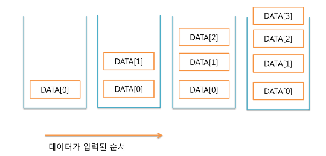
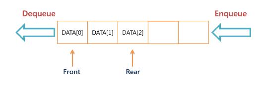

<hr>

## 목차 

[**1. Stack**](#1-stack) 

[**2. Queue**](#2-queue)

<hr>

<br>

# STACK / QUEUE

<br>

## 1. Stack 

> 스택은 데이터가 들어온 순서대로 쌓이는 형태의 기억공간이다. <br>
> **```LIFO```로 표현되며 이는 Last In First Out**으로써 나중에 들어온 것이 처음에 나간다라는 뜻이다. 



> 스택에서는 TOP, POP, PUSH라는 용어를 사용한다. <br><br>
> TOP이란 스택의 맨 위의 데이터 <br>
> 즉, 최근에 들어온 데이터를 가리키는 화살표라고 생각하면된다. <br>
> 데이터가 입/출력이 되면 TOP이 움직이면서 스택공간에 데이터가 몇개 저장되어있는지를 알 수 있다. 
> <br><br>
> PUSH란 데이터를 삽입하기 위한 것이며, TOP이 다음 데이터가 들어올 자리로 이동하면 그 자리에 데이터가 삽입된다. 
> <br><br>
> POP이란 스택에 있는 데이터를 삭제하기 위한 것이다.  <br>

### STACK ERROR 
> 데이터가 없을 때 POP을 한다면 당연히 데이터가 없기에 삭제도 할 수 없다. 이때 발생하는 에러를 ```Stack Underflow```라고 한다. <br>
> 반대로 스택의 크기, 즉 배열의 크기 이상의 자료를 PUSH하면 자료를 삽입할 수 없기때문에 ```Stack Overflow```라는 에러가 발생한다. 

<br>

## 2. Queue 

> 스택은 데이터가 들어가고 나가는 곳이 한곳이지만 큐는 들어오는 곳과 나가는 곳이 다른 자료구조이다. <br>
> **```FIFO```로 표현되며 이는 First In First Out**으로써 처음에 들어온 것이 처음에 나간다라는 뜻이다. 



> 위 그림과 같이 큐에서는 삭제가 일어나는 위치를 Front라고 하고 데이터가 있는 가장 끝 부분, 즉 삽입이 일어나는 곳을 Rear라고 한다. <br>
> 그리고 큐에서 데이터 삽입 작업을 Enqueue, 데이터 삭제 작업을 Dequeue라고 한다. 
### Queue Error 
> Stack과 마찬가지로 데이터가 없을 때 POP을 하면 ```Queue Underflow```, 큐가 꽉차 있을 때 삽입을 하면 ```Queue Overflow```가 발생한다.
