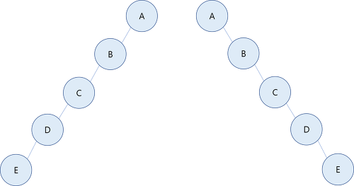
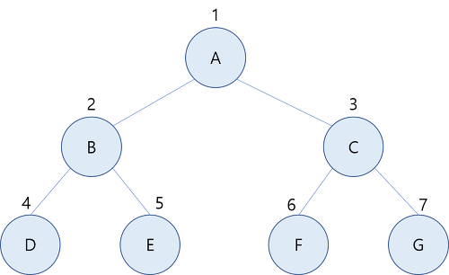
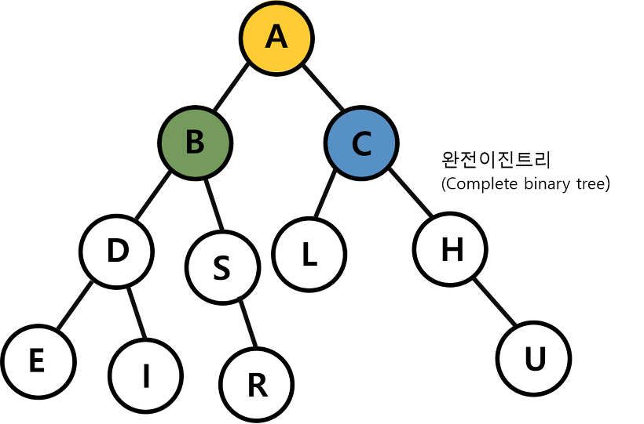
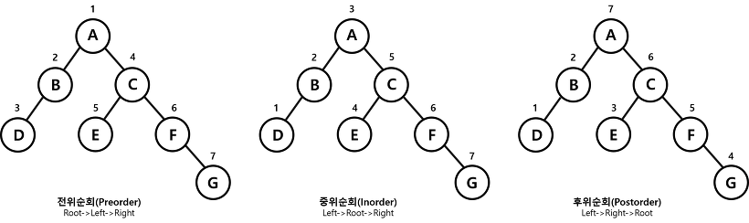

<hr>

## 목차 
[**1. Tree란**](#tree)
- [Tree의 개념](#tree의-개념)
- [Tree 용어 정리](#tree-용어-정리)
- [Tree 특징](#tree의-특징)

[**2. 이진트리**](#이진트리)
- [편향 이진트리](#편향-이진트리)
- [포화 이진트리](#포화-이진트리)
- [완전 이진트리](#완전-이진트리)

[**3. 트리순회**](#트리순회)

[**4. 트리구현**](#이진트리-구현-java)

<hr>

<br>

# Tree 

<br>

## Tree란 
> Stack과 Queue는 자료구조에서 선형구조라고 한다. 선형구조란 자료를 구성하고 있는 데이터들을 순차적으로 나열시킨 형태를 의미한다. <br>
> Tree는 비선형구조이다. 비선형구조는 선형구조와 달리 데이터가 계층적(망)으로 구성되어 있다. <br>
> 선형구조는 자료를 저장하고 꺼내는 것에 초점이 맞춰져 있고, 비선형구조는 표현에 초점이 맞춰져 있다. 

<br>

### Tree의 개념 
> 트리는 <b>노드로 이루어진 자료 구조이다.</b><br>
> 1. 트리는 하나의 루트 노드를 갖는다. 
> 2. 루트 노드는 0개 이상의 자식 노드를 갖고 있다. 
> 3. 그 자식 노드 또한 0개 이상의 자식 노드를 갖고 있고, 이는 반복적으로 정의된다. <br>

<br>

### Tree 용어 정리 
 
- 루트 노드 (root node) : 부모가 없는 노드, 최상위의 노드 
- 단말 노드 (leaf node) : 자식이 없는 노드
- 내부 노드 (internal node) : 단말 노드가 아닌 노드 
- 간선 (edge) : 노드를 연결하는 선 (link, branch 라고도 함) 
- 형제 (sibling) : 같은 부모를 가지는 노드 
- 노드의 크기 (size) : 자신을 포함한 모든 자손 노드의 개수 
- 노드의 깊이 (depth) : 루트에서 어떤 노드에 도달하기 위해 거쳐야 하는 간선의 수 
- 노드의 레벨 (level) : 트리의 특정 깊이를 가지는 노드의 집합 
- 노드의 차수 (degree) : 하위 트리 개수 / 간선 수 
- 트리의 차수 (degree of tree) : 트리의 최대 차수 
- 트리의 높이 (height) : 루트 노드에서 가장 깊숙히 있는 노드의 깊이 

<br>

### Tree의 특징 
> - 그래프의 한 종류이다. '최소 연결 트리'라고도 불린다. 
> - 트리는 계층 모델이다. 
> - 노드가 N개인 트리는 항상 N-1개의 간선을 가진다. 
> - 한 개의 루트 노드만이 존재하며 모든 자식 노드는 한 개의 부모 노드만을 가진다. 

<br>

## 이진트리 
> 이진 트리는 모든 노드가 정확하게 두 개의 서브트리를 가지고 있는 트리이다. <br> 
> <b>즉, 노드의 유한 집합으로서 공백이거나 루트와 두개의 분리된 이진트리인 경우 왼쪽서브트리와 오른쪽 서브트리로 구성된다.</b><br>

<br>

### 편향 이진트리 
> 편향 이진트리란 모든 노드가 부모의 왼쪽 자식이기 때문에 왼푠으로 편향되어 있거나 반대로 모든 노드가 부모의 오른쪽 자신으로 되어 오른쪽으로 편향되어 있어야 한다. 
> 


### 포화 이진트리 
> 포화 이진트리란 이진트리가 보유할 수 있는 최대의 노드를 가지고 있는 형태이다. 



### 완전 이진트리 
> 완전 이진트리는 이진트리에서 가장 일반적인 구조이다. 



<br>

## 트리순회 


- 전위순회 : Root를 먼저 방문 (Root → Left → Right)
- 중위순회 : 왼쪽 하위 트리를 방문 후 Root 방문 (Left → Root → Right)
- 후위순회 : 하위 트리 모두 방문 후 Root 방문 (Left → Right → Root)

<br>

## 이진트리 구현 (Java)
> 연결 리스트 기반의 트리 구현 방식은 하나의 노드에 왼쪽 자식, 오른쪽 자식의 정보를 담는 변수와 자신이 가지는 데이터만 있으면 된다. 

```java
public class TreeNode {
	private TreeNode left;
	private TreeNode right;
	private Object data;

	public TreeNode(Object item){
		left = null;
		right = null;
		data = item;
	}

    //자신과 왼쪽 자식 노드(sub)와 연결해주는 method
	public void makeLeftSubTree(TreeNode sub){
        if(this.left != null) this.left = null;
            this.left = sub;
	}

    //자신과 오른쪽 자식 노드(sub)와 연결해주는 method
	public void makeRightSubTree(TreeNode sub){
        if(this.right != null) this.right = null;
	        this.right = sub;
	}

	

    //자신의 data를 반환하는 함수
	public Object getData(){
        return this.data;
	}

	

    //자신의 왼쪽 자식노드를 반환하는 함수
	public TreeNode getLeftSubTree(){
        return this.left;
	}

    //자신의 오른쪽 자식노드를 반환하는 함수
	public TreeNode getRightSubTree(){
        return this.right;
	}
}

////////////////////////////////////////////////////////

public class main {
    public static void main(String[] args) {
        TreeNode bt1 = new TreeNode(1);
        TreeNode bt2 = new TreeNode(2);
        TreeNode bt3 = new TreeNode(3);
        TreeNode bt4 = new TreeNode(4);

        bt1.makeLeftSubTree(bt2);
        bt1.makeRightSubTree(bt3); 
        bt2.makeLeftSubTree(bt4); 

        // bt1의 왼쪽 자식노드의 데이터 출력 
        System.out.println(bt1.getLeftSubTree().getData()); // 2
    }
}
```

<br><br>

## 참고 사이트 
1. https://monsieursongsong.tistory.com/6
2. https://gmlwjd9405.github.io/2018/08/12/data-structure-tree.html
3. https://meylady.tistory.com/16