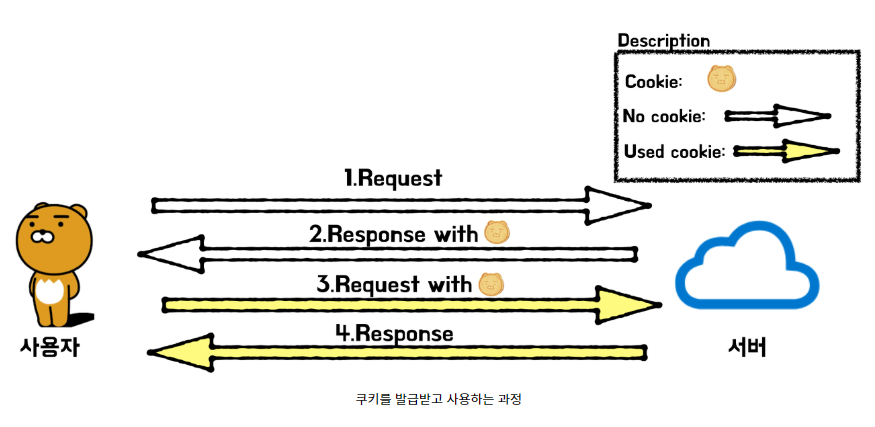

# Session / Cookie

<br>

## 1. Cookie 와 Session을 사용하는 이유

HTTP 프로토콜에는 비연결성(Connectionless)과 비상태성(Stateless)라는 특징이 있다.

> -   비연결성 : 클라이언트가 요청을 한 후 응답을 받으면 그 연결을 끊어 버리는 특징 <br>
> -   비상태성 : 연결을 끊는 순간 클라이언트와 서버의 통신이 끝나며 상태 정보는 유지하지 않는 특징

이러한 특징 때문에 서버의 자원을 크게 절약할 수 있다. <br>
하지만 이로 인해 사용자를 식별할 수 없어 같은 사용자가 요청을 여러번 하더라도 매번 새로운 사용자로 인식하는 단점이 있다.<br><br>
하지만 우리가 웹사이트를 사용할때를 생각해 보면 로그인을 한번 하고나면 그 사이트에서는 더이상의 로그인의 필요 없이 사이트 내 여러 페이지의 기능을 이용할 수 있고, 심지어는 브라우저를 종료했다가 나중에 접속해도 로그인 상태를 유지할 수도 있다.<br> <b>이러한 HTTP의 비상태, 비연결의 특성들을 보완한 기술이 쿠키와 세션이다.</b>

<br>

## 2. Cookie

### 2-1. Cookie란?

##### 사전적 의미

```
쿠키(cookie)란 HTTP의 일종으로서 인터넷 사용자가 어떠한 웹사이트를 방문할 경우
그 사이트가 사용하고 있는 서버를 통해 인터넷 사용자의 컴퓨터에 설치되는 작은 기록 정보 파일을 일컫는다.
HTTP 쿠키, 웹쿠키, 브라우저 쿠키라고도 한다.
```

> -   쿠키란 서버측에서 클라이언트 측에 상태 정보를 저장하고 추출할 수 있는 메커니즘
> -   클라이언트의 매 요청마다 웹 브라우저로부터 서버에게 전송되는 정보패킷의 일종
> -   쿠키는 클라이언트 로컬에 저장되는 키와 값이 들어있는 작은 데이터 파일
> -   <b><u>서버가 클라이언트에 전송하여 저장하는 텍스트 조각</u></b>

### 2-2. Cookie의 특징

> -   쿠키에는 이름, 값, 유효시간, 도메인 정보, 경로 정보가 들어 있다.
>     -   이름 : 각각의 쿠키를 구별하는 데 사용되는 이름
>     -   값 : 쿠키의 이름과 관련된 값
>     -   유효시간 : 쿠키의 유지시간
>     -   도메인 : 쿠키를 전송할 도메인
>     -   경로 : 쿠키를 전송할 요청 경로
> -   쿠키의 유효시간이 정해지면 브라우저가 종료되어도 인증이 유지될 수 있다.
> -   쿠키는 클라이언트의 상태 정보를 본인 하드 디스크에 저장하였다가 필요할 때 참조, 재사용한다.
> -   클라이언트에 300개까지의 쿠키를 저장할 수 있고, 하나의 도메인당 20개의 값만 가질 수 있다. 하나의 쿠키값은 4KB까지 저장함
> -   브라우저마다 저장되는 쿠키는 다름 → 서버에서는 브라우저가 다르면 다른 사용자로 인식

### 2-3. Cookie의 동작 원리



> 1. 클라이언트가 서버로 자원 요청
> 2. 서버에서 쿠리를 생성 후 HTTP 헤더에 쿠키를 포함 시켜 응답
> 3. 클라이언트에서 서버로 이전과 같은 요청을 할 경우 HTTP 헤더에 쿠키를 함께 보냄
> 4. 서버에서 쿠키를 읽어 이전 상태 정보를 변경 할 필요가 있을 때 쿠키를 업데이트 하여 변경된 쿠키를 HTTP 헤더에 포함시켜 응답

클라이언트가 서버에 요청을 하면 서버가 응답할 때 쿠키에 저장하고자 하는 정보를 Header의 `Set-Cookie`로 함께 전달

```shell
 Set-Cookie: <cookie-name>=<cookie-value>
```

클라이언트는 서버로 전송하는 모든 요청에 현재 브라우저에 저장된 모든 쿠키를 Header의 Cookie로 전달

```shell
Cookie: <cookie-name>=<cookie-value>
```

서버가 쿠키와 함께 아래와 같은 응답을 클라이언트에게 전달했다고 하면,

```shell
HTTP/1.0 200 OK
Content-type: text/html
Set-Cookie: userName=woochan
```

이후로는 해당 클라이언트는 매번 저장된 쿠키를 헤더에 포함해서 요청을 보내게 된다.

```shell
GET /test_page.html HTTP/1.1
Host: www.test.com
Cookie: userName=woochan
```

### 2-4. Cookie의 목적

> <b>1. 세션관리 (Session Management)</b> <br>
> 자동 로그인, 사용자 정보, 장바구니 등의 서버가 알아야할 정보들을 저장 <br> > <b>2. 개인화 (Personalization)</b> <br>
> 사용자마다 그 사람에 적절한 페이지를 보여줄 수 있음 <br> > <b>3. 트래킹 (Tracking)</b> <br>
> 사용자의 행동과 패턴을 분석하고 기록

<br>

## 3. Session

### 3-1. Session이란?

##### 사전적 의미

```
세션(session)은 컴퓨터 과학에서, 특히 네트워크 분야에서 반영구적이고 상호작용적인 정보 교환을 전제하는
둘 이상의 통신 장치나 컴퓨터와 사용자 간의 대화나 송수신 연결상태를 의미하는 보안적인 다이얼로그(dialogue)
및 시간대를 가리킨다.
```

~~_음... 솔직히 뭔말인지 모르겠네요_~~

> -   세션은 사용자 정보 파일을 브라우저에 저장하는 쿠키와 달리 서버측에서 관리
> -   세션은 일정 시간동안 같은 사용자로 부터 들어오는 일련의 요구를 하나의 상태로 보고 그 상태를 일정하게 유지시키는 기술이다.
> -   <b>방문자가 웹 서버에 접속해 있는 상태를 하나의 단위로 보고 그것을 세션 이라고 함</b>

### 3-2. Session의 특징

> -   각 클라이언트에게 고유 ID를 부여한다. (Session ID)
>     -   Session ID로 클라이언트를 구분하여 각 클라이언트 요구에 맞는 서비스를 제공한다.
>     -   Session Id는 브라우저 단위로 저장되고 브라우저 종료시 소멸
> -   사용자가 요청 할 때 마다 필요한 정보들을 세션에 담아두면 사용자가 디비에 접근할 필요가 없어서 효율적

### 3-3. Session의 동작원리


> 1. 클라이언트가 서버로 접속(http 요청)을 시도 (첫 요청이기 때문에 Session ID 없음)
> 2. 서버는 Session ID 쿠키 값이 없는 것을 확인하고 response-header 필드의 set-cookie 값으로 클라이언트 식별자인 Session ID를 발급해서 응답
> 3. 발급된 Session ID는 서버와 클라이언트 메모리에 저장된다.
> 4. 이후 클라이언트는 전달받은 Session ID 값을 매 요청마다 헤더 쿠키에 넣어서 요청
> 5. 서버는 Session ID를 확인하여 해당 Session ID 값에 따른 클라이언트 정보를 가져옴
> 6. 만약 클라이언트가 로그인 기능을 요청한 것이라면, 서버는 session을 로그인한 사용자 정보로 갱신하고 새로운 Session ID를 발급하여 응답
> 7. 이후 클라이언트는 새로 발급받은 Session ID 쿠키를 요청과 함께 전달하고 서버에서도 로그인된 사용자로 식별
> 8. 클라이언트 종료(브라우저 종료) 시 session ID 제거

<br>

## 4. Cookie와 Session의 차이점

> -   가장 큰 차이점은 사용자의 정보가 저장되는 위치
>     -   쿠키: Client 세션: Server
> -   보안면에서 Session이 더 안전함.
>     -   쿠키는 Client Local에 저장되기 때문에 변질되거나 request에서 Snipping 당할 우려가 있음
>     -   세션은 쿠키를 이용해서 Session ID만 저장하고 서버에서 처리하기 때문에 비교적 보안성이 좋음
> -   요청 속도는 쿠키가 세션보다 더 빠름
>     -   세션은 서버의 처리가 필요하기 때문에
> -   만료시점
>     -   쿠키도 만료시간이 있지만 파일로 저장되기 때문에 브라우저를 종료해도 계속 남아있을 수 있다.
>     -   세션은 만료시간을 정할 수는 있지만 만료시간에 상관없이 브라우저가 종료되면 삭제됨

<br>

## 5. Session / Cookie 방식의 단점 

> - 만약 A사용자의 HTTP 요청을 B사용자가 가로챘다면 그 안에 들어있는 쿠키도 충분히 훔칠 수 있다. 그리고 B 사용자는 그 훔친 쿠키를 이용해 HTTP 요청을 보내면 서버의 세션저장소에서는 A 사용자로 오인해 정보를 잘못 전달해주게 된다. 
> <br> → 세션 하이재킹 공격 
> <br> 이에 대한 해결책으로는 세션에 유효시간을 넣어준다. 
> - 서버에서 세션 저장소를 사용하는데 세션이 많아짐에 따라 서버의 부하도 높아진다. 

<br><br>

## 참고사이트

1. https://interconnection.tistory.com/74
2. https://soul0.tistory.com/106
3. https://cjh5414.github.io/cookie-and-session/
