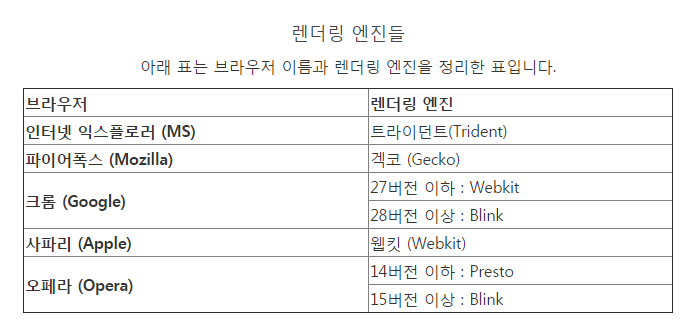
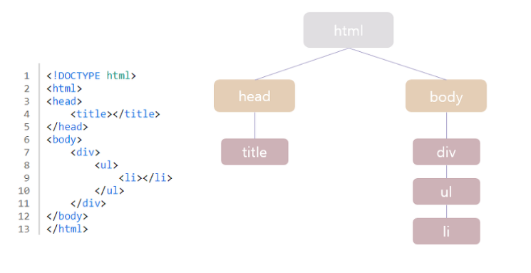

# 브라우저 렌더링 

<br>

## 1. 렌더링이란? 
> 브라우저 렌더링에 대해 알아보기 전에 당연히 렌더링이라는 용어에 대한 정리가 필요할 듯하다.<br> 
> 렌더링이란 사전에서는 "아직은 실제로 제품화 되어 있지 않은, 계획 단계에 있는 고업 제품을 전문가가 아니어도 그것의 외관을 이해할 수 있도록 실물 그대로 그린 완성 예상도" 라고 명시되어있다.<br> 
> ~~*역시 사전적의미로는 렌더링이 뭔지 잘 모르겠음*~~
> <br> 쉽게 말하자면 **웹 페이지에 필요한 HTML, CSS, JS 파일 등의 리소스들을 불러온 뒤 각종 처리 작업을 거쳐 실제 사용자가 보는 화면에 띄워주는 작업을 렌더링이라고 한다.**

<br>

## 2. 브라우저의 역할 
> 사용자가 선택한 자원(URL)을 서버에 요청하고 받아 화면에 표시한다. <br>
> → **주소창에 주소를 입력한 후, 엔터를 치면 브라우저가 해당 주소로 요청(request)을 보낸다. 이 때, 요청받은 곳, 즉 서버에서 응답을 보내준다.** <br>
> 브라우저는 요청에 대한 결과(response)를 화면에 그린다. 


<br>

## 3. 렌더링 엔진 
> 앞서 브라우저에서 서버로 request를 요청하여 서버에서 브라우저로 response로 정보를 받아온다는 것을 알았다. 
> <br> 그렇다면 브라우저는 < HTML >과 같은 문서를 어떻게 화면에 표현하게 되는것일까? 

<br>

> 먼저 브라우저는 서버에서 받아온 HTML 문서를 W3C(World Wide Web Consortium)에서 정한 명세를 따라 HTML을 해석한다. <br>
> 그리고 해석된 문서는 **브라우저 렌더링 엔진** 에 따라서 브라우저에 사용자가 볼 수 있도록 그리기 시작한다.
> <br> 렌더링 엔진은 브라우저마다 존재하지만, 브라우저마다 렌더링 엔진이 다르다. *우리가 같은 웹사이트를 접속할 때도 브라우저 마다 미세한 차이가 존재하는 이유가 렌더링 엔진이 브라우저마다 달라서 생기는 현상이다.* 
> <br> 렌더링 엔진이 다름에도 웹 사이트를 비슷하게 보여줄 수 있는 까닭은 W3C에서 정한 웹표준 명세가 있기 때문이다.
> <br><br> → **브라우저 엔진의 역할은 요청 받은 내용을 브라우저 화면에 표시하는 일을 담당**

### 3-1 주요 브라우저의 종류와 렌더링 엔진 



<br>

## 4 브라우저의 구조 


- UI : 주소창, 즐겨찾기 등 사용자가 조작 가능한 영역
- 브라우저 엔진 : UI와 렌더링 엔진 동작 제어
- 렌더링 엔진 : 요청한 결과(응답)를 화면에 표시
- 네트워킹 : HTTP 요청과 같은 네트워크 호출을 위해서 필요한 부분.
- UI 백엔드 : OS 사용자 인터페이스 방법을 활용하여, 기본적인 위젯(콤보 박스등)을 그림
- JS 엔진/인터프리터 : 자바스크립트를 해석하고 실행
- 데이터 저장소 : Local Storage, Indexed DB, 쿠키 등 브라우저 메모리를 활용하여 저장하는 영역

<br>

## 5. 렌더링 엔진 동작 과정 


렌더링 과정은 총 5단계로 이루어 진다. (스타일 구조체 생성을 따로 구분하지 않고 4단계로 표현하기도 함)

### 0. HTML을 DOM으로 만들기 위한 파싱 작업 

#### 0-1. 변환 (Conversion) 
> 브라우저가 HTML 파일을 디스크나 네트워크에서 읽어온 뒤 해당 파일에 지정된 인코딩으로 변환 

#### 0-2. 토큰화 (Tokenizing) 
> HTML 파일 문자열을 W3C HTML5 표준에 지정된 고유 토큰으로 변환한다. <br>
> 예를들면 ```<html>```,```<body>``` 같은 태그에 사용되는 문자열을 토큰화 하는 것이다. 

#### 0-3. 렉싱 (Lexing) 
> 반환된 토큰은 각각의 속성 및 규칙을 정의하는 '객체'로 변환된다. 

### 1. DOM 트리 생성 
> 파싱 작업으로 생성된 객체를 트리 데이터 구조로 연결시킨다. HTML 마크업이 여러 태그간의 관계를 나타내기 때문에 DOM은 트리 구조를 가진다. 따라서, DOM에 포함된 노드 또한 서로 관계를 가지게 된다. 
> <br> 해당 작업을 통해서 우리가 알고 있는 HTML이 생성되는 것이다. 여기서 생성된 결과물이 DOM이라 하며, 트리 구조로 되어 있어 DOM 트리라고도 한다. <br><br>


### 2. 스타일 구조체 생성(CSSOM생성)
> 브라우저가 HTML을 파싱하는 과정에서 대부분은 head 태그의 하위로 link 태그가 존재해 CSS 파일을 불러오게 된다. CSS 파일을 불러온 뒤 HTML과 마찬가지로 브라우저가 이해하고 처리할 수 있는 형식으로 변환해야 한다. 
> <br> 그 과정은 DOM을 생성하는 과정과 동일하다. 단, 출력된 결과는 CSSOM(CSS Object Model)이라고 부르며, DOM트리와 마찬가지로 트리구조로 되어 있어 CSSOM 트리라고도 부른다. <br><br>


### 3. 렌더 트리 생성 
> 앞의 과정에서 만들어진 DOM 트리와 CSSOM 트리는 서로 연관이 없는 독립적인 객체이다. 따라서 이 두개의 트리를 결합하여 **렌더 트리**를 생성한다. <br>
> <br> 렌더 트리는 DOM 트리의 최상위 노드부터 각각의 노드를 탐색하여 렌더링에 필요한 노드들을 CSSOM 트리와 일치시켜 생성한다. <br>
> - *렌더링 출력에 반영되지 않는 불필요한 노드들은 건너뛰게 된다.(< script > < meta > 등)* <br>
> 
> 즉, 렌더 트리는 페이지를 렌더링하는 데 필요한 **가시적인 노드만** 포함된다. 그러므로 ```display: none```으로 스타일이 지정된 노드또한 제외된다. 
> <br> 그러나, ```visibility : hidden``` 속성은 렌더트리에 포함되는데 그 이유는 보이지는 않지만 공간을 차지하고 있기 때문이다. 

### 4. 레이아웃 처리 (Layout & Reflow)
> → 렌더 트리를 생성함으로써 스타일을 적용했으니 **노드의 크기 계산과 해당 위치에 배치**를 해야 함
> <br><br>
> 렌더 트리는 DOM트리와 CSSOM 트리에 의해 정의된 스타일만 계산하였다. 하지만 기기의 뷰포트(Viewport) 내에서의 정확한 위치 및 크기는 계산되지 않았다. 
> <br> 예를 들어 CSS에 ```width: 50%;```로 정의되어 있다고 하면, 실제 브라우저에서 표현되는 정확한 사이즈가 계산되지 않았다는 의미이다. 
> <br> 따라서 브라우저에 출력하기 전 실제 출력되는 정확한 위치와 크기를 계산하여야 한다. 그 단계가 **레이아웃** 또는 **리플로우** 단계라고 한다. 이 단계에서는 각 객체의 정확한 위치 및 크기를 계산하기 위해 렌더 트리의 루트에서부터 탐색해 실제 픽셀 값을 구하여 박스모델을 출력한다. 
> <br> 박스모델의 넓이는 뷰포트 (ICB) 기준으로 측정되고, 높이는 Contents 기준으로 측정된다. 따라서 **윈도우 사이즈를 변경하거나, 폰트를 변경하면 리플로우가 다시 발생**되게 되는 것이다. 

### 5. 페인트 
> 스타일, 크기, 배치가 끝났으니 화면에 노드를 포현하는 작업이다. 

<br><br><br>
## 참고 사이트 
1. [Web Browser의 렌더링 과정] 
2. [도담도담 블로그]
3. [장한보람블로그]

[Web Browser의 렌더링 과정]:https://memory.today/dev/36
[도담도담 블로그]:https://do-dam.tistory.com/entry/%EC%9B%B9-%ED%8E%98%EC%9D%B4%EC%A7%80%EC%9D%98-%EB%9E%9C%EB%8D%94%EB%A7%81-%EA%B3%BC%EC%A0%95-1%ED%8E%B8
[장한보람블로그]:https://janghanboram.github.io/2018/06/06/browser-rendering/