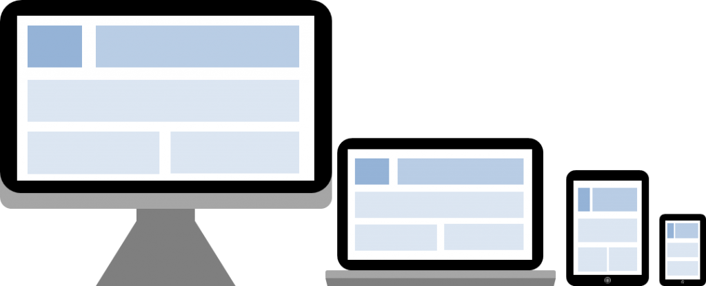

# Responsive Web Design 

<br>

## 1. Responsive Web Design 이란? 

> 반응형 웹 디자인이란 하나의 웹사이트에서 PC, 스마트폰, 태블릿 PC 등 접속하는 디스플레이의 종류에 따라 화면의 크기가 자동으로 변하도록 만든 웹페이지 접근 기법을 말한다. <br>
> 웹 사이트를 PC용과 모바일용으로 각각 별개로 제작하지 않고, 하나의 공용 웹사이트를 만들어 다양한 디바이스에 대응할 수 있다. <br>
> <b>즉, 반응형 웹사이트란 하나의 웹사이트를 구축하여 다양한 디바이스의 화면 해상도에 최적화된 웹사이트를 제공하는 것이다.</b>



<br>

## 2. viewport meta tag 

> viewport란 사용자가 시각적으로 볼 수 있는 웹페이지 영역을 의미한다. viewport는 디바이스별로 크기가 다양하며, 모바일 디바이스의 경우 PC보다 뷰포트가 작다. 이때문에 데스크탑에 기반하여 설계된 웹페이지를 모바일에서 보면 기본 viewport가 980px이고 이로 인해 내용이 작게 보인다. 즉, 작은화면의 모바일 단말기에서 웹 페이지를 모두 표시하려고 하니 전체적인 페이지의 배율이 조정되는 것이다. <br>
> 모바일 화면에 맞도록 전체적인 페이지가 축소되어 보이지만 페이지 컨텐츠의 배율 축소가 발생해 가독성이 떨어지게 된다. 이때 viewport를 설정하면 다양한 모바일 기기에서도 페이지의 너비나 화면 배율을 설정할 수 있다. 

### 2-1 일반적인 viewport 설정 
```
<meta name="viewport" content="width=device-width, initial-scale=1.0">
```
가로폭을 디바이스의 가로폭에 맞추고 초기 화면 배율을 100%로 설정하는 것을 의미한다. 

<br>

## 3. Media Query 

> 반응형 웹디자인에 사용되는 핵심 기술로써, CSS3에 포함되어 있으며 자바스크립트 등을 사용하지 않고도 특정 요소에 해상도별로 대응하는 스타일을 각각 적용시킬 수 있도록 해준다. 정확히는 Media Type 을 이용한 표현식을 통해 스타일의 적용 범위를 한정할 수 있다. 

### 3-1 기본 형태 
```
@media [Only | Not] MediaType and (조건식) and (조건식) and ... {
  /* 실행문 */
}
```

### 3-2 조건식을 이루는 대표적인 Media Feature 
><b>width (max-width, min-width) / height (max-height, min-height)</b><br>
뷰포트의 너비와 높이를 나타낸다. 뷰포트의 크기는 HTML 컨텐츠의 내용을 표시하는 전체적인 크기를 말하며, 화면의 크기와는 거리가 있는 개념이다.
>
><b>device-width / device-height</b> <br>
디바이스가 출력할 수 있는 영역의 크기, 즉 스크린의 해상도를 의미한다.
>
><b>orientation</b> <br> 
화면이 세로모드인지 가로모드인지 판단할 수 있다. 이를 판단하는 기준은 뷰포트의 너비와 높이의 비율이다.
>
><b>aspect-ratio (max-aspect-ratio, min-aspect-ratio)</b> <br>
스크린의 너비와 높이의 비율. Value 는 너비/높이 형태로 작성한다. 너비와 높이의 비율을 4:5로 하고싶다면 4/5로 작성하면 된다.

### 3-3 임의의 해상도에 따른 breakpoint 정의 


- Media Query 사용 예

```
<!DOCTYPE html>
<html lang="en">
<head>
    <meta charset="UTF-8">
    <meta name="viewport" content="width=device-width, initial-scale=1.0">
    <title>Media Query 예제</title>
    <style>
        // width 값이 1025px 보다 큰 값은 배경화면 red  
        body { background-color: red; }

        // width 값이 768px ~ 1024px 까지는 배경화면이 blue
        @media (max-width:1024px) {
            body { background-color: blue;}
        }

        // width 값이 481px ~ 768px 까지는 배경화면이 yellow
        @media (max-width:768px) {
            body { background-color: yellow; }
        }

        // width 값이 0 ~ 480px 까지는 배경화면이 black
        @media (max-width:480px) {
            body { background-color: black; }
        }
    </style>
</head>
<body>
    
</body>
</html>
```