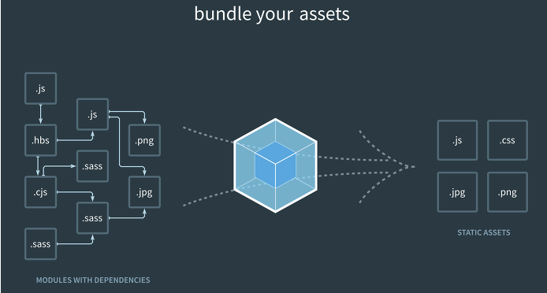
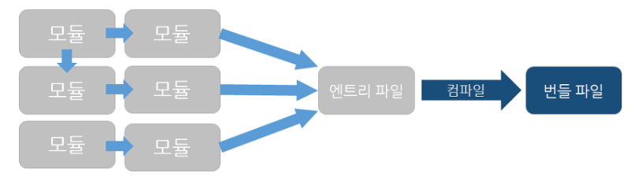

# WebPack 

 

## 1. 개요 

서버에서 처리하는 로직을 JavaScript로 구현하는 부분이 많아지면서 웹 서비스 개발에서 JavaScript로 작성하는 코드의 양도 늘어났다. 코드의 양이 많아지면서 코드의 유지와 보수가 쉽도록 코드를 모듈로 나누어 관리하는 모듈 시스템이 필요해진다.  
그러나, Javascript는 언어 자체가 지원하는 모듈 시스템이 없다. 이런 한계를 극복하려는 여러가지 도구를 활용하는데 그 도구중 하나가 Webpack이다.

 

## 2. 모듈 번들러란? 

> 대부분의 프로그래밍 언어에서는 코드를 여러 개의 파일에 나누고 이 파일들에 담겨있는 기능들을 사용하기 위해서 애플리케이션에서 임포트할 수 있다.  
> 하지만 브라우저에서 임포트를 사용할 수 없으며, 모듈 번들러가 기능을 대신 지원한다. 
>  대부분의 모듈 번들러는 npm이나 Bower와 직접적으로 통합되어 있어서 써드-파티 의존성을 쉽게 애플리케이션에 추가할 수 있도록 만들어 줍니다. 

#### 번들러 (bundler)

- 번들(bundle)을 만드는 도구를 의미 
- Webpack 같은 빌드 도구는 다수의 자바스크립트 파일과 정적자원을 모아 소수의 파일로 만들기 때문에 완료된 결과물을 번들이라고 할 수 있음. 
- 번들을 생성하는 과정을 번들링이라고 함 

 

## 3. Webpack 이란?

> - 웹팩은 모듈 번들러 이다. 
> - 웹팩은 상호 의존성이 있는 모듈들을 사용해 그 모듈들과 같은 역할을 하는 정적 에셋들을 생성한다. 
> - 작성한 자바스크립트 파일을 최적화하여 적은 수의 파일로 사용자 요청을 처리하는 것 

Webpack은 세 가지 모듈인 CommonJS, AMD, ES6 모듈을 모두 지원한다. 
Webpack이 프로젝트 내 모든 자바스크립트의 의존성을 분석한 후 다음과 같은 작업을 수행한다. 
- 모든 의존 모듈을 올바른 순서로 불러온다. 
- 모든 의존 모듈을 한 번씩 불러오도록 한다. 
- 자바스크립트 파일이 가능한 한 적은 파일로 묶여지도록 한다. (정적 자원)

### Webpack 동작 방식 
1. 각 기능 단위별로 module을 정의 
2. module을 로딩 
3. module로 만들어진 파일을 웹브라우저에서 사용 가능하도록 컴파일 한다. (bundling)  이때, module을 웹브라우저에서 사용할 수 있도록 컴파일하는 역할을 webpack이 함. 

< webpack 컴파일 과정 >

 

## 4. 참고 사이트
1. https://ithub.tistory.com/166