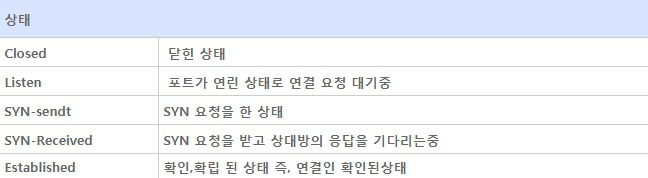

# TCP 3-Way-Handshake

 

## 3 Way Handshaking 

> TCP통신은 신뢰성있는 통신을 하기 위해 3번의 패킷 교환을 한다. 이를 3 Way-Handshaking 이라고 하며 데이터의 동기화라고도 한다.  
> 동기화 과정은 TCP프로토콜을 이용해서 통신을 하는 응용프로그램이 데이터를 전송하기 전에 먼저 정확한 전송을 보장하기 위해 상대방 컴퓨터에 사전에 세션을 수립하는 과정을 의미하고 이러한 과정을 통해 서로의 통신을 위한 포트를 확인하고 연결한다.

### 3-way-Handshaking 과정 

> [STEP 1]  
> 클라이언트는 서버에 접속을 요청하는 SYN 패킷을 보낸다.  
> 이 때 클라이언트는 SYN을 보내고 SYN/ACK 응답을 기다리는 SYN_SENT 상태가 된다. 
>   
> [STEP 2] 
> 서버는 SYN요청을 받고 클라이언트에게 요청을 수락한다는 ACK와 SYN FLAG가 설정된 패킷을 발송하고 클라이언특가 다시 ACK로 응답하기를 기다린다. 
>   이 떄 서버는 SYN_RECEIVED 상태가 된다. 
>   
> [STEP 3] 
> 클라이언트는 서버에게 ACK를 보내고 이후로부터는 연결이 이루어지고 데이터가 오가게 되는것이다.  
> 이 때 서버 상태는 ESTABLISHED이다. 

  

## 참고사이트 
1. https://mindnet.tistory.com/entry/%EB%84%A4%ED%8A%B8%EC%9B%8C%ED%81%AC-%EC%89%BD%EA%B2%8C-%EC%9D%B4%ED%95%B4%ED%95%98%EA%B8%B0-22%ED%8E%B8-TCP-3-WayHandshake-4-WayHandshake
2. https://hack-cracker.tistory.com/120