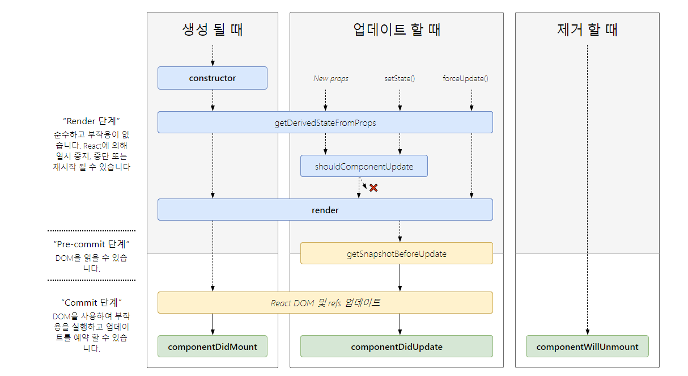

# React Component Life Cycle

 

 <u>*리액트 17부터는 componenetWillMount, componentWillUpdate, componenetWillReceiveProps 라이프 사이클이 deprecated 됩니다.*</u> 

> Render : render() → ComponentDidMount()  
> Update : shouldComponentUpdate() → render() → componentDidUpdate()

 

### render 

> - 모든 컴포넌트는 render function을 가지고 있음 
> - '뭔가를 보여주는, 출력하는' 기능 

### Mount 

> Component가 처음 실행 될 때 그것을 Mount라고 표현한다. 컴포넌트가 시작되면 우선 context, defaultProps와 state를 저장한다.  
> 그 후에 componentWillMount 메소드를 호출한다. 그리고 render로 Component를 DOM에 부착한 후 Mount가 완료된 후 componentDidMount가 호출된다. 
> - componentWillMount에서는 props나 state를 바꾸면 안된다.  
> → Mount 중이기 때문에 
> - componentDidMount에서는 DOM에 접근할 수 있다.  
> → 주로 AJAX 요청을 하거나 setTimeout, setInterval 같은 행동을 함 

 

## 라이프사이클 이벤트 분류 

### 1. 마운팅 이벤트 
- React 엘리먼트(컴포넌트 클래스의 인스턴스)를 DOM 노드에 추가할 때 발생 
- 한번만 실행됨 

    #### componentWillMount()
    > - 실행 시점은 초기 렌더링 직전 
    > - ReactDOM.render()를 호출해서 React 엘리먼트를 브라우저에 렌더링하는 시점에서 실행됨 

    #### componentDidMount() 
    > - 초기 렌더링을 마친 후에 실행된다. 
    > - 자식 엘리먼트를 참조로 접근할 수 있다. (DOM 요소에 접근할 수 있다.)

### 2. 갱신 이벤트 
- 속성이나 상태가 변경되어 React 엘리먼트를 갱신할 때 발생 
- 바깥 세상 (다른 프레임워크, 라이브러리, 데이터 저장소 등)과 연결하는데 사용 
- 여러번 실행될 수 있음 

    #### shouldComponentUpdate()
    > - 렌더링 직전에 실행됨
    > - shouldComponentUpdate()에서 false를 반환하도록 구현하면 React가 다시 렌더링되지 않도록 할 수 있다.   → 변경된 부분이 없고, 불필요한 성능 저하를 피하고자 할 때 

    #### componentWillUpdate() 
    > - 새로운 속성이나 상태를 받은 후 렌더링 직전에 호출됨 
    > - shouldComponentUpdate() 가 false를 반환하면 componentWillUpdate()는 실행되지 않는다. 

    #### componentDidUpdate()
    > - 컴포넌트의 갱신 결과가 실제 DOM에 반영된 직후에 실행된다. 

### 3. 언마운팅 이벤트 
- React 엘리먼트를 DOM에서 제거할 때 발생 
- 한번만 실행됨 

    #### componentWillUnmount() 
    > - DOM에서 컴포넌트가 제거되기 직전에 호출된다. 
    > - 정리하기 위한 코드를 이 메서드에 추가할 수 있다.  
    ex) 타이머를 제거하거나, DOM요소 정리, componentDidMount()에 연결한 이벤트 제거 