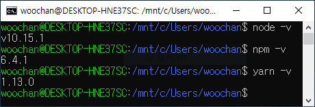

# React 

 

## 1. 시작하기 

### window에서 Windows Subsystem for Linux를 사용하여 Ubuntu 설치(bash)

> 1. https://webnautes.tistory.com/1170
> 2. https://blogs.msdn.microsoft.com/eva/?p=7633

### Ubuntu에 Node.js, npm, yarn 설치

\- Node.js 설치

    curl -sL https://deb.nodesource.com/setup_10.x | sudo -E bash -
    sudo apt-get install -y nodejs

\- npm 설치  

    Node.js 를 설치하면 내장되어 있어서 따로 설치할 필요 없다. 

\- yarn 설치

    curl -sS https://dl.yarnpkg.com/debian/pubkey.gpg | sudo apt-key add -
    echo "deb https://dl.yarnpkg.com/debian/ stable main" | sudo tee /etc/apt/sources.list.d/yarn.list

    sudo apt-get update && sudo apt-get install yarn

#### 설치 완료

### Create-React-App 

    npx create-react-app my-app 
    cd my-app 
    npm start 

이전에는 'npm install -g create-react-app' 과 같이 글로벌하게 설치했었는데, 글로벌하게 설치했을 경우 몇가지 문제가 발생한다.  

1. 모듈 업데이트를 까먹는다는 것. 
2. 사용없이 글로벌하게 설치해서 용량을 잡아먹는다는 것 

- npx 
  - npm 패키지들을 컴퓨터 저장없이 사용할 수 있게 해줌
  - npm 버전 5 이상이라면 이미 npx는 설치되어 있음 