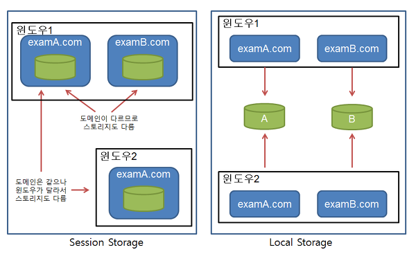

## 1. HTML에서 JavaScript 코드가 body 맨 밑에 넣는 이유 

- 웹 브라우저가 HTML 문서를 해석(Parsing) 할 때 \
        </body>
      </html>

 

# 2. var, let, const

- var는 function-scoped이고, let, const는 block-scoped 이다. 

## 스코프(Scope)
> - 어떤 변수들에 접근할 수 있는지를 정의 
> - 어떤 선언된 변수가 있다면 이 변수가 유효한 공간적 범위를 말함 
> - 전역 스코프(Global Scope)  
  \- 변수가 함수 바깥이나 중괄호 바깥에 선언되었다면, 전역 스코프에 정의된다고 한다. 
  \- 전역 변수를 선언하면, 코드 모든 곳에서 해당 변수를 사용할 수 있다.
> - 지역 스코프(Local Scope) 
  \- 코드의 특정 부분에서만 사용할 수 있는 변수
>   - 함수 스코프(function-scope)
>   - 블록 스코프(block-scope)

### 함수 스코프(Function Scope)
- 함수 내부에서 변수를 선언하면, 그 변수는 선언한 변수 내부에서만 접근 가능 

      function sayHello () {
         const hello = 'Hello CSS-Tricks Reader!'
         console.log(hello)
        }

        sayHello() // 'Hello CSS-Tricks Reader!'

        console.log(hello) // Error, hello is not defined

### 블록 스코프(Block Scope) 
- 중괄호 내부에서 const또는 let으로 변수를 선언하면, 그 변수들은 중괄호 블록 내부에서만 접근 가능 
  
        {
          const hello = 'Hello CSS-Tricks Reader!'
          console.log(hello) // 'Hello CSS-Tricks Reader!'
        }
        console.log(hello) // Error, hello is not defined

### var, let, const 
> - var, let은 변수를 선언하는 키워드이고, const는 상수를 선언하는 키워드 
> - let과 const는 block-scoped로 블록 내부에 let, const로 선언된 변수는 외부 스코프에 영향을 주지 않는다.
> - let과 const는 ECMA6에 도입된 키워드이며, <u>var로 인해 발생하는 혼란스럽고 불 명확한 코드작성을 피하기 위하여</u> 만들어 졌다. 

 

## **var vs let   (왜 let을 써야 하는가? var가 어떠한 혼란을 불러일으키는가?)**
### 1. var 키워드는 변수명을 재선언해도 아무런 문제가 발생하지 않는다. 

      var userName = "JeongWooChan";

      .... // 긴 코드가 존재한다고 가정 

      var userName = "정우찬"; // 아무런 문제가 발생하지 않는다.
                              -> 앞서 선언한 userName="JeongWooChan"이 의도치 않게 유실된 것이다.

### 반면, let은 변수명 재선언시 에러를 발생시킴 
      let userName = "JeongWooChan"; 

      .... // 긴 코드가 존재한다고 가정 

      let userName = "정우찬"; // SyntaxError 발생

 

### 2. var 키워드는 호이스팅(hoisting)이라는 메커니즘을 통해 끌어 올려진다.
\* 호이스팅(hoistiong) : 끌어올리다.  
    
      console.log(userName); // 선언되지 않은 변수를 console 출력
      var userName = "정우찬"; 
      console.log(userName); 

      >> 실행 결과 
      undefined
      정우찬 

- 선언되지 않은 변수를 console로 출력했음에도 정상적으로 동작하는 것을 확인할 수 있다.   그 이유는 var 키워드는 자바스크립트 해석기가 호이스팅을 통해 재해석하기 때문이다. 
  
※ var의 호이스팅을 막기 위해서는 자바스크립트 scope에 'use strict'를 사용해야 한다. 
      
      'use strict'
      console.log(userName); 
      var userName = "정우찬"; 
      console.log(userName);

      >> 실행 결과 
      ReferenceError : userName is not defined 

 

### 3. var 키워드 변수로 인한 전역스코프 오염의 위험 
- var 키워드 변수는 scope에 가두려면, 반드시 함수가 필요하다. 그래서인지 var 키워드 변수를 function-scoped라고 부른다. 

      var age = 20; // 전역스코프 영역 

      if(age = 20) {
          var age = "홍길동"; 
          console.log("name : " + age);
      }

      // 20대신 홍길동이 찍힌다. 위에 4줄의 작은 조건문에서의 실수가 전역스코프를 오염시켜
         프로그램 전체에 큰 영향을 미친다.
      console.log(age);

### let, const 키워드는 block-scoped, 즉 블록 내부에 let, const로 선언된 변수는 외부 스코프에 영향을 주지 않는다. 

      let age = 1; 

      if(age = 1) {
          let age = 3; 
      }

      console.log(age); // 전역스코프에 선언된 age는 오염되지 않고 여전히 1의 값 유지 

 

# 3. classList

> -  javascript에서 class를 제어할 수 있는 방법 중 하나 
> -  add, remove, contains, toggle 함수를 제어 
>    - add : 특정 클래스 값을 추가한다. 만약 요소의 속성에 추가하려는 클래스가 존재한다면 무시된다. 
>    - remove : 특정 클래스 값을 제거한다. 
>    - toggle : 한개의 인수만 있을 때 : 클래스 값을 변환한다. 즉 클래스가 존재한다면 지우고 false를 반환하고, 존재하지 않다면 그것을 추가하고 true를 반환한다.  두번째 인수가 있을 때: 두번째 인수가 true로 평가되면 특정 클래스 값을 추가하고 false로 평가되면 지운다. 
>    - contains : 특정 클래스 값이 요소의 클래스 속성에 존재하는지 확인한다. 

 

     function handleClick() {
       const hasClass = title.classList.contains(CLICKED_CLASS);
       if(hasClass) {
         title.classList.remove(CLICKED_CLASS);
        } else {
         title.classList.add(CLICKED_CLASS);
        }
     }

위의 코드를 toggle을 이용해 간단히 나타낼 수 있다.
 

    function handleClick() {
       title.classList.toggle(CLICKED_CLASS);
    }

 

# 4. setInterval()

일정 시간마다 반복 실행하는 함수 

### 사용방법 
- setInterval()  사용
> setInterval ( function(){ ... }, 지연시간 );

      playAlert = setInterval ( function() {
            alert('3초 마다 실행됩니다.');
      }, 3000);

- clearInterval()  
> clearInterval을 사용하여 setInterval의 수행작업을 중지시킬 수 있다. 

      clearInterval(playAlert);

 

# 5. Web Storage

> 웹 스토리지란 클라이언트쪽에 소량의 데이터를 저장해 두기 위한 스토리지 

### 쿠키 

> - 4KB의 저장 용량 → 크기가 작다.
> - 같은 사이트내에서 둘 이상의 탭을 열었을 때, 둘 이상의 트랜잭션 추적에 어려움이 있다. 

### 웹 스토리지 

> - JavaScript 객체를 저장할 수 있다. (정확히는 객체의 복사본이 저장된다.)
> - Session Storage와 Local Storage가 있다. 

 

## Web Storage

### Session Storage 
> - 도메인마다 따로 생성된다. 
> - 윈도우와 같은 유효범위와 생존기간을 가진다. 
> - 새로 생성된 윈도우와 기존 윈도우의 세션 스토리지는 서로 영향을 주지 않는다. 

### Local Storage 
> - 도메인마다 따로 생성된다. 
> - 지속기간에 제한이 없다. → 사용자가 명시적으로 지우지 않는 한 영구적으로 저장됨 
> - 도메인이 다르면 서로의 로컬 스토리지에 접근할 수 없다. 
> - 같은 도메인에 소속된 웹페이지는 모두 같은 로컬 스토리지를 가진다. 
> - Cookie를 이용한 사이트 고유 설정 정보등을 대신하기에 적당하다. 

Session과 Local의 차이점은 로컬은 지속성을 가지기 때문에 여러 창을 켜도 같은 도메인이라면, 같은 스토리지를 사용하는 것이다.  
세션 스토리지는 각 세션마다 새로운 스토리지를 사용하고 폐기한다. 

 

# 6. 참고 사이트 
1. https://blog.hanumoka.net/2018/09/21/javascript-20180921-javascript-var-let-const/
2. https://gist.github.com/LeoHeo/7c2a2a6dbcf80becaaa1e61e90091e5d  
3. https://croute.me/419