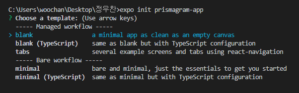

# Expo CLI로 React-Native 시작하기 

<br>

> 앞서 ReactNative CLI와 Expo CLI 비교 글에서 설명했다시피, Expo CLI를 사용하면 매우 빠르고 쉽게 React Native 프로젝트를 시작할 수 있다. <br> 
> Expo로 프로젝트를 시작하기 위해서는 Node.js 10 LTS 이상의 버전이 설치되어 있어야 한다. 

<br>

## 1. Expo CLI 설치 
```shell 
npm install -g expo-cli 
yarn global add expo-cli
```

<br>

## 2. Expo 프로젝트 생성 
```shell
expo init 프로젝트명 
```

<br>


> 명령어 입력시 먼저 template을 선택한다. <br>
> 기본으로 blank를 설정하며, TypeScript를 사용할것이라면 blank (TypeScript)를 선택하면 된다. <br>

<br>

## 3. Expo 프로젝트 실행 
```shell
npm start
yarn start 
```
> 설치가 완료되면 ```npm start``` 혹은 ```yarn start```로 앱을 실행시킬 수 있다. 