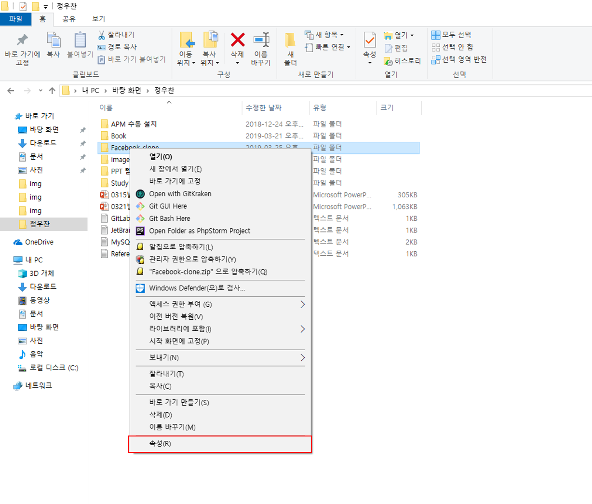
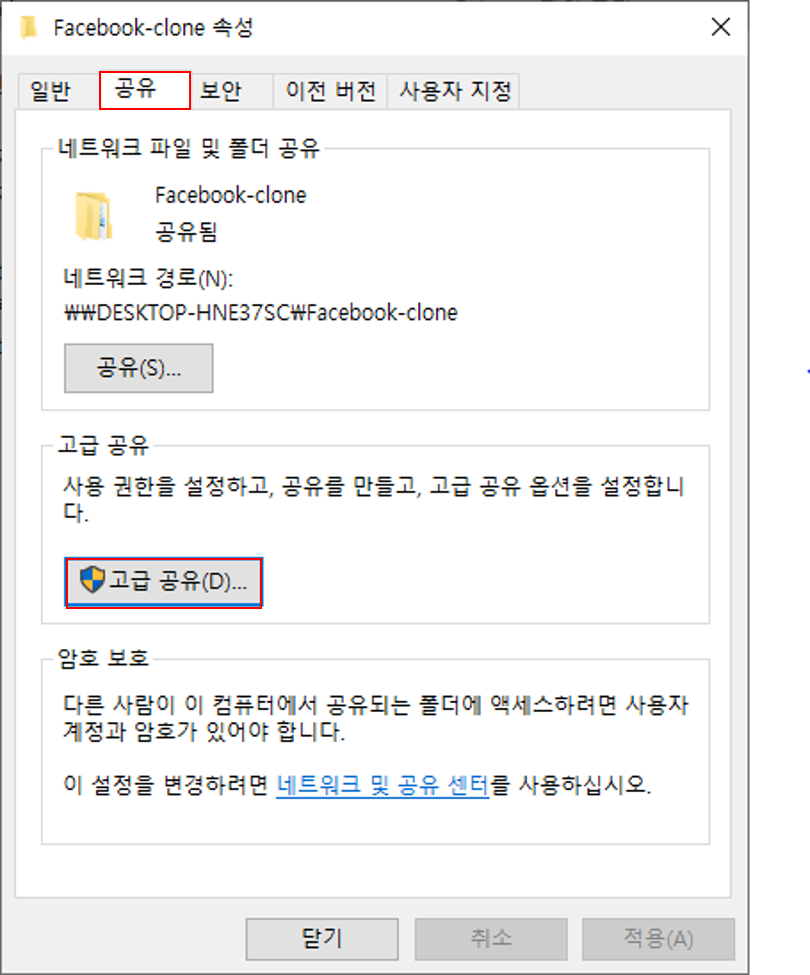
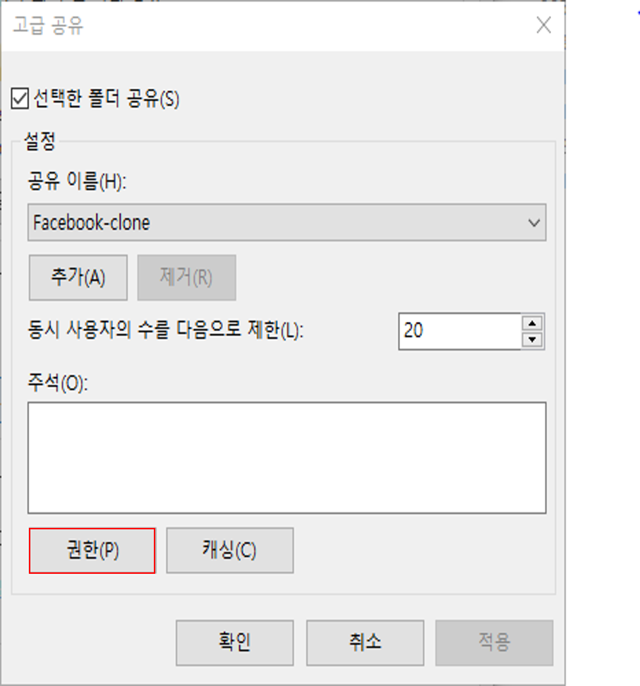
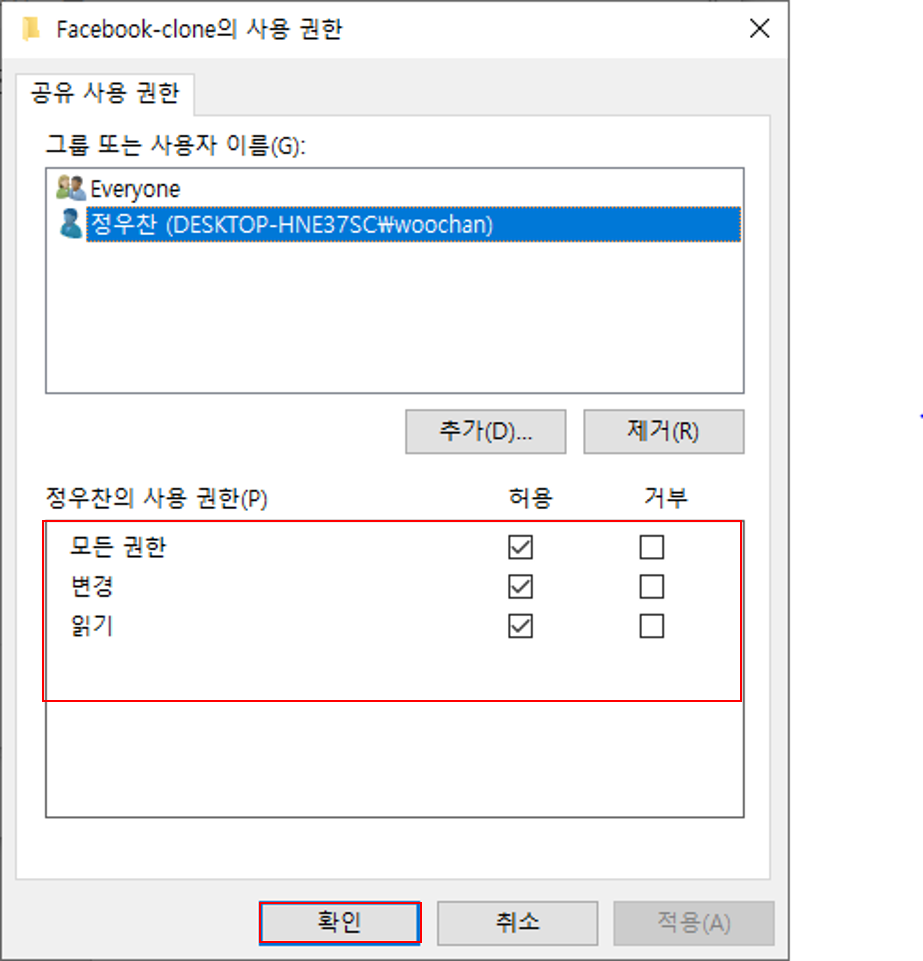
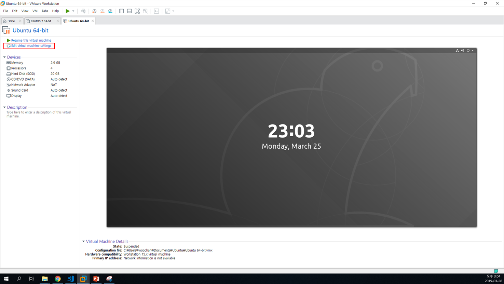
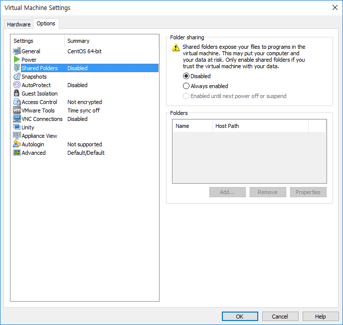
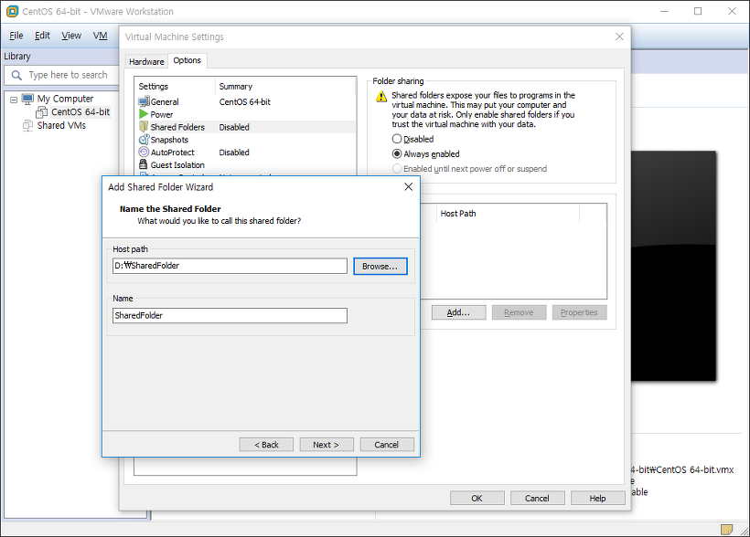
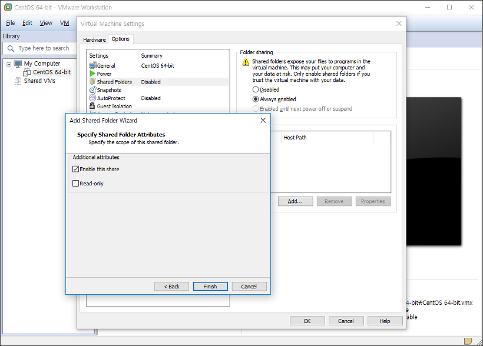
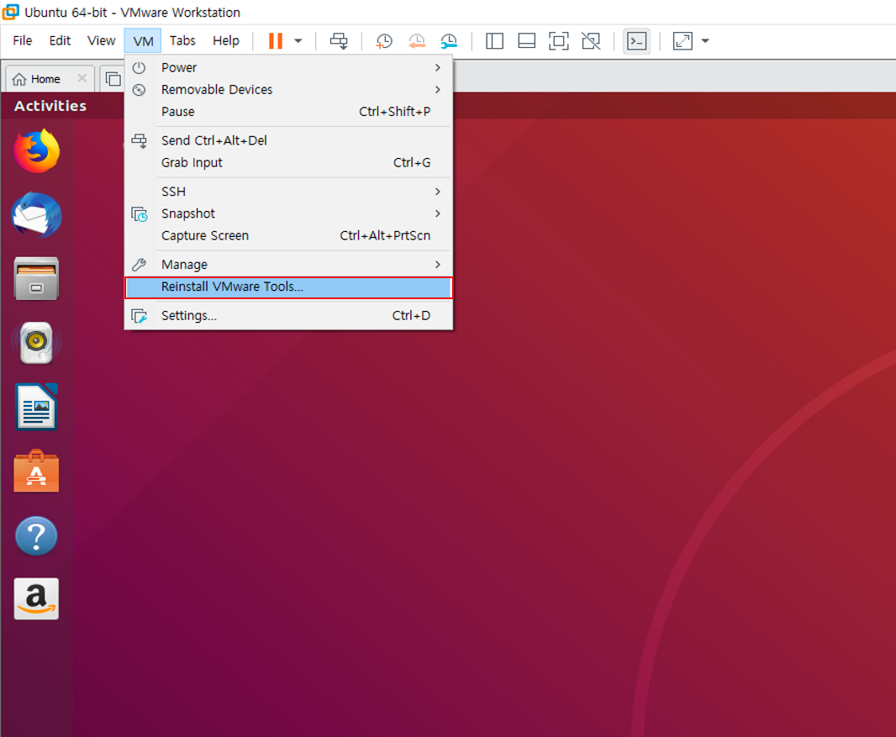

# VMware 공유폴더 설정 

<br>

## 1. 윈도우 공유 폴더 설정 

1-1) 윈도우에서 공유하고자 하는 폴더에 마우스 오른쪽 클릭 하여 <b>속성</b> 클릭


1-2) 속성에서 <b>공유탭</b> - <b>고급 공유</b> 클릭 


1-3) 고급 공유에서 <b>권한</b> 클릭 


1-4) <b>모든 권한을 허용</b>한 후에 적용 - 확인


<br><br>

## 2. VMware에서 공유 폴더 기능 설정 

2-1) VMware에서 Ubuntu를 실행하기 전에 <b> Edit virtual machine settings </b> 클릭



2-2) <b>Options</b> 탭의 <b>Shared Folders</b> 항목에서 <b>Folder sharing</b>을 <b>Always enabled</b>로 변경 



2-3) Add 버튼을 클릭한 후 <b>공유 폴더 위치 및 이름</b>을 저장 후 Next버튼 클릭 


2-4) 공유 속성과 읽기전용 속성중 원하는 옵션 선택 후 Finish 


2-5) Ubuntu 실행 

2-6) VMware의 <b>VM</b>탭에서 <b>Reinstall VMware Tools</b> 클릭 <br>
※Reinstall VMware Tools가 비활성화 되어 있을 경우에는 <b>Edit virtual machine settings</b> 에서 Hardware탭의 Floppy 항목을 제거하고 CD/DVD (SATA) 항목의 Connection을 Auto detect로 설정 해준다. 



2-7) 터미널 실행후 아래 명령어를 순서대로 입력 

```
cd /mnt 
sudo mkdir cdrom
sudo mount /dev/cdrom /mnt/cdrom 
cd cdrom 
sudo cp VMWareTools-10.3.2-9925305.tar.gz /usr/local/src (cdrom에서 ls로 확인) 
cd /usr/local/src 
sudo tar zxvfp VMware-10.3.2-9925305.tar.gz
cd vmware-tools-distrib/
sudo ./vmware-install.pl
```

설치 작업을 모두 완료한 후에 mnt폴더의 hgfs폴더에 공유폴더가 존재함을 확인할 수 있다. 